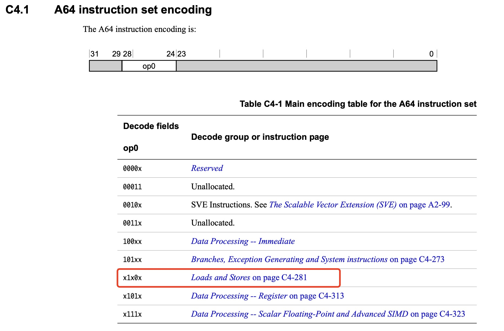

#Arm64访存指令

##Arm手册中对于访存指令的分类

---

---

##单条指令是否可以直接计算访问的内存地址？ 

###Arm64：字长为32位，地址信息无法完整嵌入，需额外运行时信息  
❌寄存器辅助寻址：**寄存器值**辅助寻址  
❌相对寻址：**当前指令PC**辅助寻址  
❌文字池寻址：**文字池地址**辅助寻址,做法为仅在指令中存储文字池的index，文字池中存储真正访问地址  

###X86-64:字长为边长，部分寻址模式下可以直接计算访存地址  
✅绝对寻址：直接使用指令中的立即数进行寻址  
❌寄存器辅助寻址：**寄存器值**辅助寻址  

