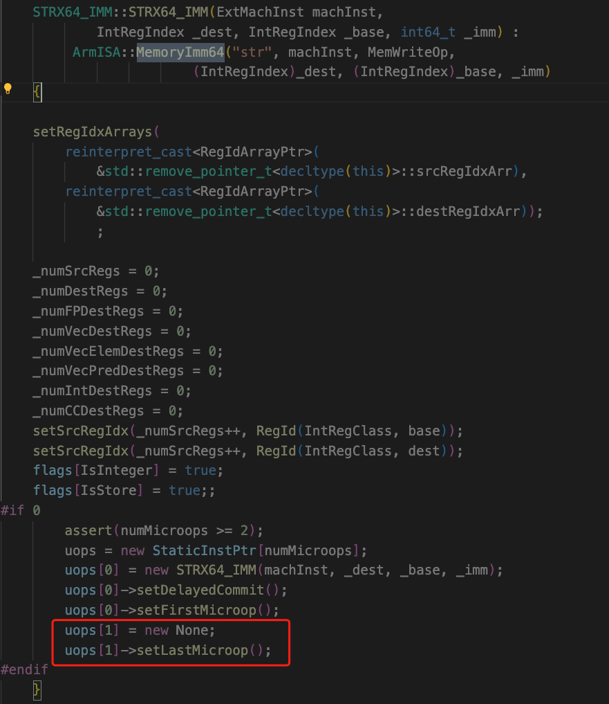
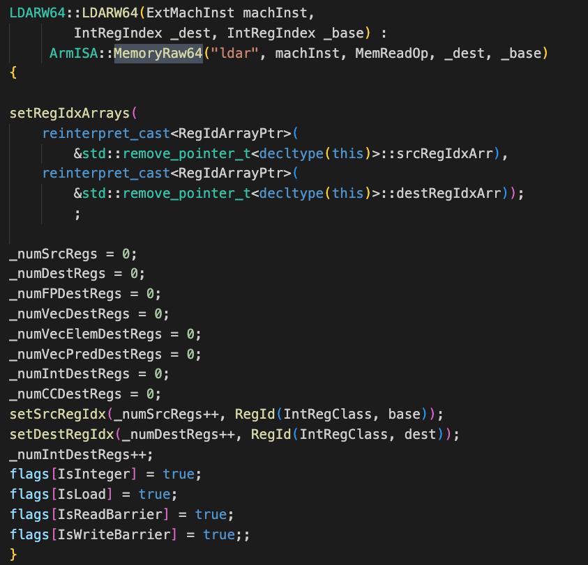

#Gem5中宏指令对应的微指令数量统计
##方法
使用numMicroops变量全局搜索

##搜索结果
###1.arch/armgenerated/decoder-ns.hh.inc❌
发现代码：numMicroops = machInst.fpscrLen + 1
fpscr：Floating-Point Status and Control register 浮点状态和控制寄存器 应该是一个？
跑了一个arm64的helloworld程序machInst.fpscrLen打印出来都是0，那么微指令只有一个

对应的指令opcode：
1.VfpMacroRegRegOp
2.VfpMacroRegImmOp
3.VfpMacroRegRegImmOp
4.VfpMacroRegRegRegOp

###存在两个mem相关指令
1.Memory64继承自MightBeMicro64继承自ArmStaticInst
2.MacroMemOp继承自PredMacroOp继承自PredOp继承自ArmStaticInst
LdmStm继承自MacroMemOp
ldmstm指令在arm32中存在，在arm64中被移除，被ldp、stp代替
不再考虑MacroMemOp

###arch/arm/insts/macromem.cc 
MacroMemOp -> 2-5 ?❌
```
if (!ones) {
    numMicroops = 1;
} else if (load) {
    numMicroops = ((ones + 1) / 2)
                + ((ones % 2 == 0 && exception_ret) ? 1 : 0)
                + (copy_base ? 1 : 0)
                + (writeback? 1 : 0)
                + (pc_temp ? 1 : 0);
} else {
    numMicroops = ones + (writeback ? 1 : 0);
}
```
####长浮点数的mem指令 2-3✅
BigFpMemImmOp -> 1-2 ? 
BigFpMemPostOp -> 2-3 ?
#####对应opcode指令分类数量
- BigFpMemImmOp被**BigFpMemImmOp**继承，opcode为**ldur** or **stur**
- BigFpMemPostOp被**BigFpMemPost**继承，opcode为**str** or **ldr**
####向量寄存器的mem指令 2:5✅
VldMultOp -> 1-2 ?
VldMultOp VstMultOp VstSingleOp VstSingleOp -> 1->4 ?
```
//第一部分 1 or 2
numMicroops = (regs > 2) ? 2 : 1;
//第二部分 0 or 1
if (wb) numMicroops++;
//第三部分
//regs / elems取值范围为 1-2
if (deinterleave) numMicroops += (regs / elems);
```
####向量寄存器mem指令 2-9✅
VldMultOp64 -> 1-n ?
VstMultOp64
VstSingleOp64
VldSingleOp64
```
//第一部分 0-1
numMicroops = wb ? 1 : 0;
//第二部分 1-4
int totNumBytes = numRegs * dataSize / 8;

int numMemMicroops = totNumBytes / 16;
int residuum = totNumBytes % 16;
if (residuum)
    ++numMemMicroops;
numMicroops += numMemMicroops;
//第三部分 1-4
int numMarshalMicroops = numRegs / 2 + (numRegs % 2 ? 1 : 0);
numMicroops += numMarshalMicroops;
```
#####对应的opcode数量（4个）
- VldMultOp64被**VldMult64**继承，opcode为**vldmult64**
- VstSingleOp64被**VstSingle64**继承，opcode为**vstsingle64**
- VldMultOp64被**VldMult64**继承，opcode为**vldmult64**
- VstMultOp64被**VstMult64**继承，opcode为**vstmult64**
####普通指令RFE 3✅
####普通指令SRS 2✅
####内存访问 

####Memory64访问 ❌
继承自Memory64的几个类：MemoryImm64、MemoryReg64、MemoryRaw64、MemoryEx64、MemoryLiteral64
- MemoryImm64指令类对应的指令：ldr、ldtr、str、sttr等，对应2个micro指令，第二个指令为none
- MemoryReg64指令类对应的指令：ldr、ldrb、str、strb等，对应2个micro指令，第二个指令为none
- MemoryLiteral64指令类对应的指令：ldr等，对应2个micro指令，第二个指令为none
- 
- MemoryRaw64指令类对应的指令：ldar、stlr等，没有micro指令对应关系？
- 
- MemoryEx64指令类对应指令：cas、ldaddlb等，没有micro指令？
- 

RfeOp -> 3
SrsOp -> 2
Memory -> 3
Memory64 -> 3

####SVE相关指令 2-8 ✅
SveLdStructSS 2-n ?
SveStStructSS
SveLdStructSI
SveStStructSI
```
numMicroops = numregs * 2;
```

SveIndexedMemVI -> ?
```
int num_elems = ((machInst.sveLen + 1) * 16) / sizeof(RegElemType);

numMicroops = num_elems;
if (isLoad) {
    if (firstFault) {
        numMicroops += 2;
    } else {
        numMicroops++;
    }
}
```
##### 对应的opcode指令分类数量
- SveLdStructSS 
  - { "ld2b", "ld2h", "ld2w", "ld2d" },
    { "ld3b", "ld3h", "ld3w", "ld3d" },
    { "ld4b", "ld4h", "ld4w", "ld4d" } 
- SveStStructSS
  - { "st2b", "st2h", "st2w", "st2d" },
    { "st3b", "st3h", "st3w", "st3d" },
    { "st4b", "st4h", "st4w", "st4d" }
- SveLdStructSI
  - { "ld2b", "ld2h", "ld2w", "ld2d" },
    { "ld3b", "ld3h", "ld3w", "ld3d" },
    { "ld4b", "ld4h", "ld4w", "ld4d" }
- SveStStructSI
  - { "st2b", "st2h", "st2w", "st2d" },
    { "st3b", "st3h", "st3w", "st3d" },
    { "st4b", "st4h", "st4w", "st4d" }

opcode名字这么随意？ **是的**

####Tcommit64 -> 2 ✅


