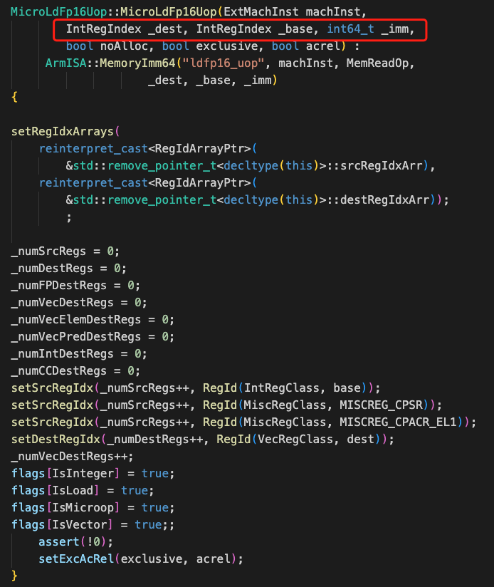

# Gem5宏指令、微指令信息存储

## decode方法输出为
- 普通指令
- 宏指令 + 微指令序列

## 宏微指令分别存储的哪些信息 
以ldp宏指令为例，继承关系从高到低为：
- ArmStaticInst: Arm指令基类
- PredOp：增加了ConditionCode
- PredMacroOp：设置了flag isMacro=true，增加了微指令数量、微指令列表指针
- PairMemOp：使用了寻址模式，根据传入的各个条件在这里生成了对应的微指令
- LdpStp：无额外变量

以ldp的一类微指令**MicroLdFp16Uop**为例，其包含信息
- 寻址base寄存器号
- 目标寄存器号
- 地址偏移量立即数

##结论
宏指令**没有存储**指令的主要信息，其主要作为微指令序列容器，**微指令存储指令信息**

##其他
decode在字节序列里提取信息，用于生成特定的指令信息类。这些信息可能不会以变量的形式存在于指令信息类中，因为一个指令信息类本身带有一定的属性。
例如：微指令信息类**MicroLdFp16Uop**带有**read** + **fp**两个属性
- 寻址模式
- 操作数类型 int or fp
- read or load
- size
- imm
