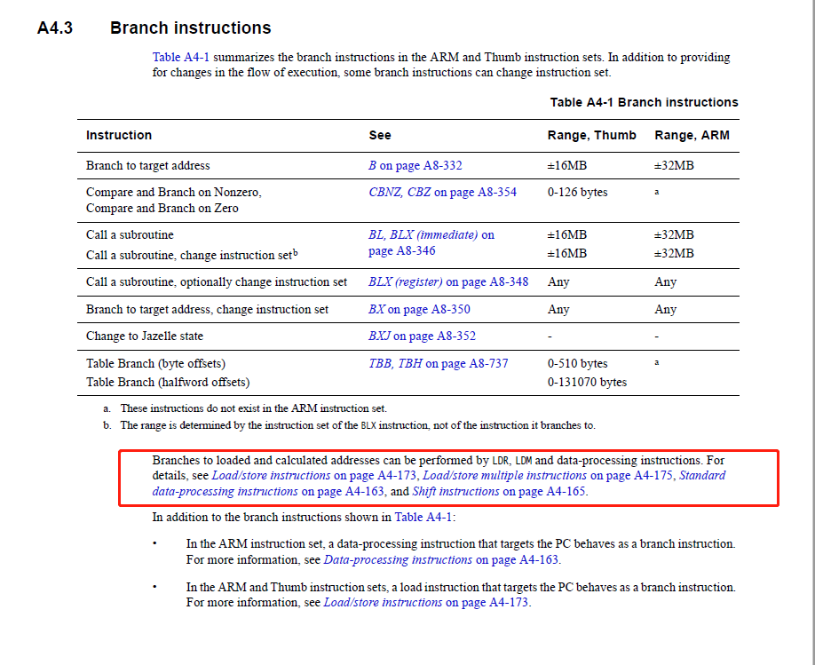
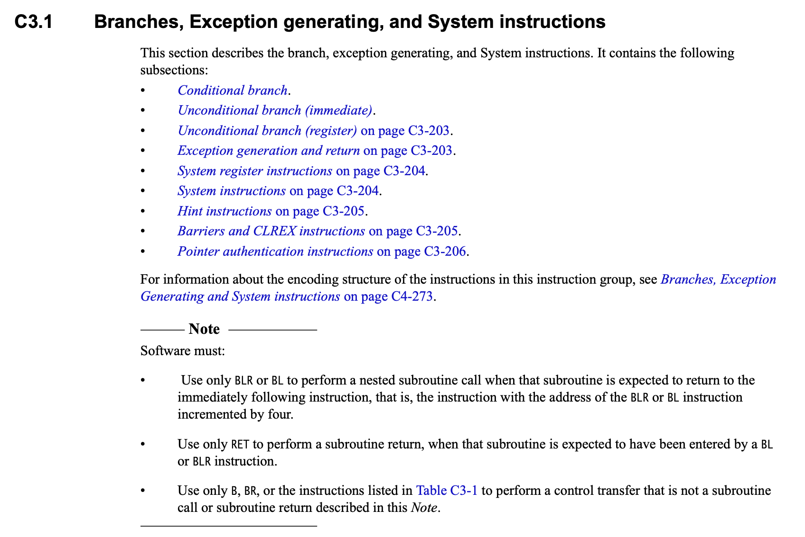

# AArch64 O3cpu指令预测行为

## 指令预测行为
- 非跳转指令：next_pc = cur_pc + 4
- 跳转指令：next_pc由分支预测期计算

## 动态指令信息类中的next_pc
在初始化时传入的

## 指令手册上的说法

### 在ARM32（ARMv7以及之前），4类指令会涉及到branch跳转行为
- branch指令
- load类指令：以pc寄存器为参数
  - LDR、LDM, LDMDA, LDMDB, LDMIB, POP 
- 数据处理类指令：以pc寄存器为参数
  - CMN, CMP, TEQ,  TST 
- 移位运算：以pc寄存器为参数
  - ASR LSL LSR ROR RRX

#### 后三类指令虽不是branch指令，但其会涉及branch行为。load类指令中的LDM是一个可以拆分的宏指令
--- 



### 在ARM64（ARMv8）中，pc寄存器（x31）不可直接访问
- branch行为仅限制在Branch类指令中

--- 


## 研究一下ldm(Load Multiple registers)指令拆分的情况

文档：[here](https://developer.arm.com/documentation/dui0473/m/arm-and-thumb-instructions/ldm)
- 语法
  - LDM{addr_mode}{cond} Rn{!}, reglist{^}
根据decode过程会得到几个参数：
- addr_mode地址的遍历方式（正常情况是累加一个字长）
- rn：基址寄存器
- reglist：需要操作的寄存器列表
- writeback：指令结束时是否将结束地址写入rn寄存器

```
MacroMemOp::MacroMemOp(const char *mnem, ExtMachInst machInst,
                       OpClass __opClass, IntRegIndex rn,
                       bool index, bool up, bool user, bool writeback,
                       bool load, uint32_t reglist) :
    PredMacroOp(mnem, machInst, __opClass)
{
    ...
}
```